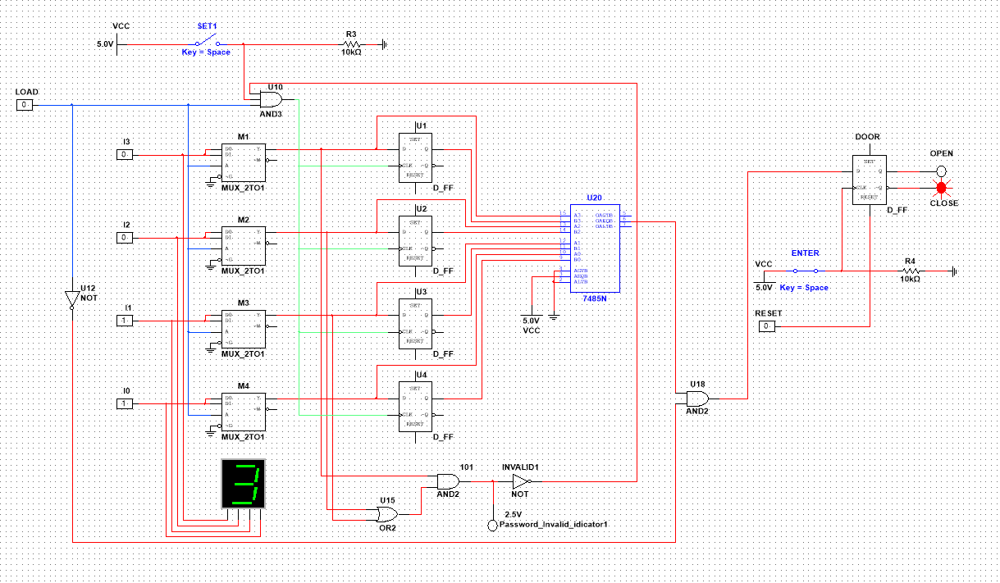
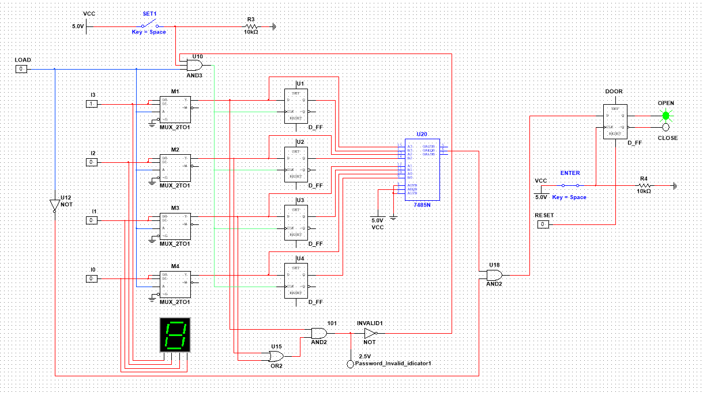
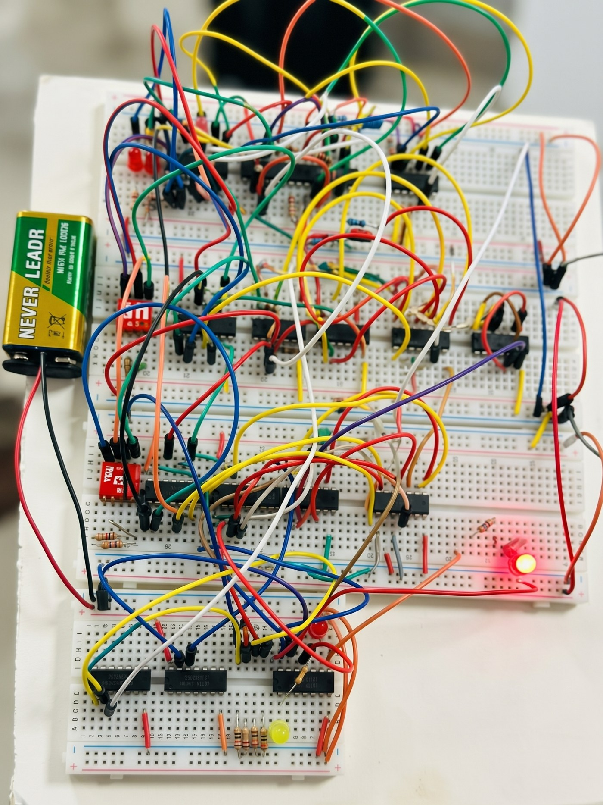

# 3-Digit Digital Password Lock (Digital Logic Design Project)

A 3-digit digital password lock designed with basic digital logic components only (**no microcontroller**) and simulated in **NI Multisim**. The password is stored in D flip-flops, compared with the user input using XNOR gates, and a BCD validation circuit rejects invalid digits (10–15). A green LED indicates *door open* and a red LED indicates *door closed*.

## Features

- Each digit is entered as 4-bit **BCD** using switches (3 digits = 12 bits).
- **Password setting mode** (`LOAD = 1`): the password is stored in D flip-flops.
- **User input mode** (`LOAD = 0`): the input is compared with the stored password.
- **BCD validation:** values 10–15 are rejected and an *invalid* indicator turns on.
- **ENTER** button checks the password and **RESET** button closes the door.
- Door status: Green LED = open, Red LED = closed.

## Components Used

| Component | Purpose |
|-----------|---------|
| D Flip-Flop | Stores the password bits |
| 2×1 Multiplexer (MUX) | Selects between password-setting mode and user-input mode |
| XNOR Gate | Bit-by-bit comparison of stored and entered password |
| AND Gate | Combines all comparator outputs (all bits must match) |
| NOT Gate | Inverts the LOAD signal |
| BCD validation logic | Blocks inputs from 10 to 15 |
| BCD to 7-segment decoder (CD4511 / 7447) | Digit display (see build notes) |
| LEDs (Green / Red) | Door open / closed indication |

## Folder Structure

```
DLC-Digital-Password-Lock/
├── Multisim_Files/          # Multisim circuits, in development order
│   ├── 01_1-bit_Password_Lock.ms14
│   ├── 02_4-bit_Password_Lock.ms14
│   ├── 03_BCD_0-9_Password_Basic.ms14
│   ├── 04_BCD_0-9_Password_Validated.ms14
│   ├── 05_3-digit_Password_Lock_Simulation.ms14
│   └── 06_3-digit_Password_Lock_Hardware.ms14
├── Project_Documents/
│   └── DLC_Project_Report_Draft.pdf
├── Images/                  # Component diagrams used in the report
├── Screenshots/             # Circuit diagrams and hardware photo
├── Archive/                 # Old test files and Multisim auto-backups
│   ├── Test_Files/
│   └── Multisim_Auto_Backups/
├── .gitattributes
├── .gitignore
└── README.md
```

## How to Run

1. Install **NI Multisim** (files are in `.ms14` format, i.e. Multisim 14).
2. Open `Multisim_Files/05_3-digit_Password_Lock_Simulation.ms14` for the simulation.
3. Open `Multisim_Files/06_3-digit_Password_Lock_Hardware.ms14` for the hardware-oriented design.
4. Run the simulation and try the test cases below.

## Test Cases (from the report)

| LOAD | Input | ENTER | RESET | Result |
|------|-------|-------|-------|--------|
| 1 | 8 (1000) | – | – | Stored as password, door stays closed |
| 1 | 10 (1010) | – | – | Rejected, *Invalid* indicator on, door closed |
| 0 | 3 (not equal to stored 8) | pressed | – | Door closed (Red LED) |
| 0 | 8 (equal to stored 8) | pressed | – | Door open (Green LED) |
| 0 | 8 (equal to stored 8) | pressed | pressed | Door closed (Red LED) |

## Project Screenshots

### 1. Circuit Diagram: wrong password (door closed)

LOAD = 0, input 3 does not match the stored password 8, so the Red LED stays on.



### 2. Circuit Diagram: correct password (door open)

LOAD = 0, input 8 matches the stored password 8 and ENTER is pressed, so the Green LED turns on.



### 3. Hardware Breadboard Setup



## Documents

- [Project Report (draft)](Project_Documents/DLC_Project_Report_Draft.pdf): abstract, theory, methodology, simulation screenshots, discussion, conclusion.

## Future Improvements

- Add more digits to the password.
- Integrate a microcontroller for a more flexible design.

## Author

**Your Name**: add your name, ID and course here.
